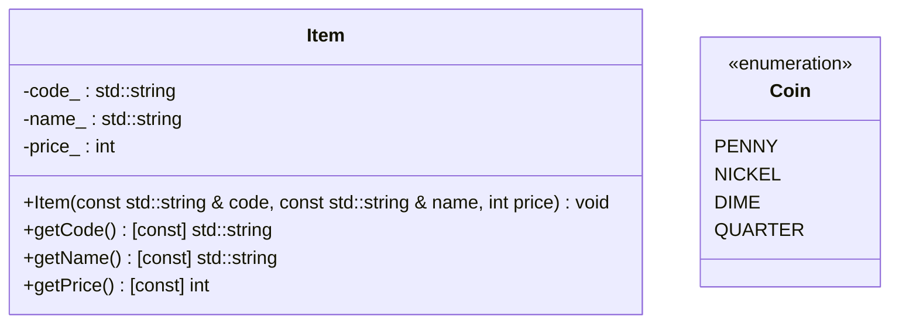

# vending-machine

## Class diagram

Generated with `make uml` (clang-uml).

<!-- uml:start -->

```mermaid
classDiagram
    class C_0010974026732188692056["Item"]
    class C_0010974026732188692056 {
        +Item(const std::string & code, const std::string & name, int price) void
        +getCode() [const] std::string
        +getName() [const] std::string
        +getPrice() [const] int
        -code_ : std::string
        -name_ : std::string
        -price_ : int
    }
    class C_0001178905747249209597["Coin"]
    class C_0001178905747249209597 {
        <<enumeration>>
        PENNY
        NICKEL
        DIME
        QUARTER
    }
```

<!-- uml:end -->
